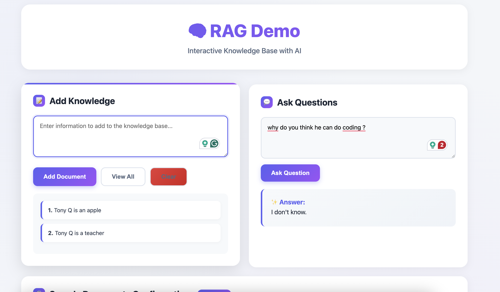

# Simple RAG Demo

A minimal, elegant Retrieval-Augmented Generation (RAG) system using Python with an in-memory vector store.

<p align="center">
  
</p>

**✨ New: Interactive web interface for easy demos!**

👉 See [QUICKSTART.md](QUICKSTART.md) for a quick 3-step setup guide.

## Features

- **🌐 Interactive web interface** - Beautiful UI for demos and experimentation
- **Simple in-memory vector database** - No external DB setup required
- **Semantic search** - Uses sentence transformers for embeddings
- **LLM integration** - OpenAI API for answer generation
- **Clean prompt engineering** - Following RAG best practices from the docs
- **Minimal dependencies** - Flask, OpenAI, sentence-transformers, and numpy

## Setup

### 1. Install UV (if not already installed)

```bash
curl -LsSf https://astral.sh/uv/install.sh | sh
```

### 2. Clone and install dependencies

```bash
cd /Users/jerryliu/rag_demo_1
uv sync
```

### 3. Configure environment variables

Copy the example env file:

```bash
cp .env.example .env
```

Edit `.env` and add your keys:

```bash
# Required: OpenAI API key
OPENAI_API_KEY=sk-xxxxxxxxxxxxx

# Optional: Use a different OpenAI model
OPENAI_MODEL=gpt-3.5-turbo

# Optional: HuggingFace token for faster model downloads
# Get from: https://huggingface.co/settings/tokens
HF_TOKEN=hf_xxxxxxxxxxxxx
```

The project automatically loads all variables from `.env` when running.

## Usage

### 🌐 Web App (Recommended)

Launch the interactive web interface:

```bash
uv run python app.py
```

Then open http://localhost:5000 in your browser.

**Features:**
- 💬 **Chat-style conversation** - Full conversation history with context
- 💾 **Conversation history** - Save, load, and manage past conversations
- 📚 **Show source documents** - See which docs were used for each answer
- ➕ **Document management** - Add, view, delete individual documents
- 📥 **Export/Import** - Save and load knowledge bases + conversations as JSON
- ⚙️ **Configure samples** - Edit default documents that load on startup
- 🔄 **Auto-persistence** - Conversations auto-saved to localStorage
- 🎨 **Modern UI** - Clean, responsive interface with smooth animations
- ⌨️ **Keyboard shortcuts** - Fast workflow for power users
- 🏗️ **Clean architecture** - Modular code with separation of concerns

**Keyboard shortcuts:**
- `Enter` to send message in chat
- `Shift+Enter` for new line
- `Ctrl+Enter` in document field: Add document

### 📟 Command Line

**Quick Start:**

```bash
uv run python rag.py
```

This runs the demo with Tony Q's employee profile.

**Run Examples:**

```bash
uv run python example.py
```

Includes 3 different scenarios:
- Employee directory
- Product documentation
- Using metadata for organization

### Use in Your Code

```python
from rag import SimpleRAG

# Create RAG instance
rag = SimpleRAG()

# Add documents to knowledge base
rag.add_document("Your document text here")
rag.add_document("Another document", metadata={"source": "api-docs"})

# Query the knowledge base
answer = rag.generate_answer("Your question here")
print(answer)
```

## How It Works

1. **Indexing**: Documents are converted to embeddings using `sentence-transformers`
2. **Retrieval**: User query is embedded, then top-k similar documents are found using cosine similarity
3. **Generation**: Retrieved documents are formatted into a prompt following RAG best practices
4. **LLM Call**: The prompt is sent to GPT-3.5-turbo for answer generation

## Architecture

```
User Query
    ↓
Embedding Model
    ↓
Similarity Search (Cosine)
    ↓
Top-K Documents Retrieved
    ↓
Format RAG Prompt
    ↓
OpenAI API
    ↓
Generated Answer
```

## RAG Prompt Template

The system uses this prompt structure (from `/doc/prompt_gpt.txt`):

```
You are a helpful assistant.

Follow these rules:
- Use ONLY the provided context
- Be concise and factual
- If unsure, say "I don't know"
- Do not make up information

Context:
{retrieved_documents}

Question:
{user_query}

Helpful Answer:
```

## Files

**Web App:**
- `app.py` - Flask backend with REST API
- `templates/index.html` - Main HTML template
- `static/styles.css` - Modern white-themed CSS
- `static/app.js` - Client-side JavaScript (chat, document management)

**Core RAG:**
- `rag.py` - Core RAG implementation with embeddings
- `rag_local.py` - Optional local LLM variant (no API costs)
- `example.py` - Command-line usage examples

**Configuration:**
- `pyproject.toml` - Project dependencies for UV
- `config.json` - Sample documents (user-editable, not committed)
- `config.example.json` - Example config template
- `.env` - API keys and settings (not committed)
- `.env.example` - Example environment variables

**Documentation:**
- `README.md` - Full documentation (this file)
- `QUICKSTART.md` - Quick 3-step setup guide

## Configuration

### Sample Documents (`config.json`)

The web app loads sample documents from `config.json` on startup. You can edit this:

1. **Via Web UI**: Go to the "Sample Documents Configuration" section
2. **Via File**: Edit `config.json` directly

Example `config.json`:
```json
{
  "sample_documents": [
    "Your first sample document",
    "Your second sample document"
  ]
}
```

The config file is auto-created on first run. Use `config.example.json` as a template.

### Conversation History

Conversations are automatically saved to browser localStorage and can be persisted to the server.

**Auto-save (LocalStorage):**
- Conversations persist across page refreshes
- Stored in browser only
- No server interaction needed

**Server-side storage:**
1. Click **"📥 Save"** to save current conversation to server
2. Click **"💾 History"** to view all saved conversations
3. Load, export, or delete individual conversations
4. Export all conversations as single JSON file
5. Import previously exported conversations

**Conversation files:**
- Stored in `conversations/` directory
- Named with timestamp: `20260324_143022.json`
- Contains full message history with sources
- Can be shared between users

## Environment Variables

All variables are loaded from `.env` automatically:

- **OPENAI_API_KEY** (required) - Your OpenAI API key for GPT models
- **OPENAI_MODEL** (optional) - Defaults to `gpt-3.5-turbo`, can use `gpt-4` or other models
- **HF_TOKEN** (optional) - HuggingFace token for faster model downloads without rate limits
  - Without token: ~100 req/hour limit
  - With token: Significantly higher limits
  - Get your token from: https://huggingface.co/settings/tokens

## Notes

- The embedding model (`all-MiniLM-L6-v2`) is lightweight and runs on CPU
- For larger deployments, consider external vector databases like Pinecone, Weaviate, or Milvus
- You can swap embeddings model by passing `embedding_model` to `SimpleRAG()`
